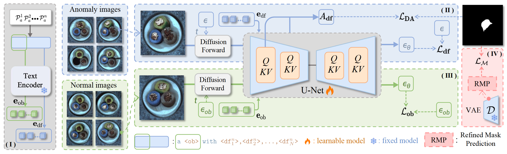
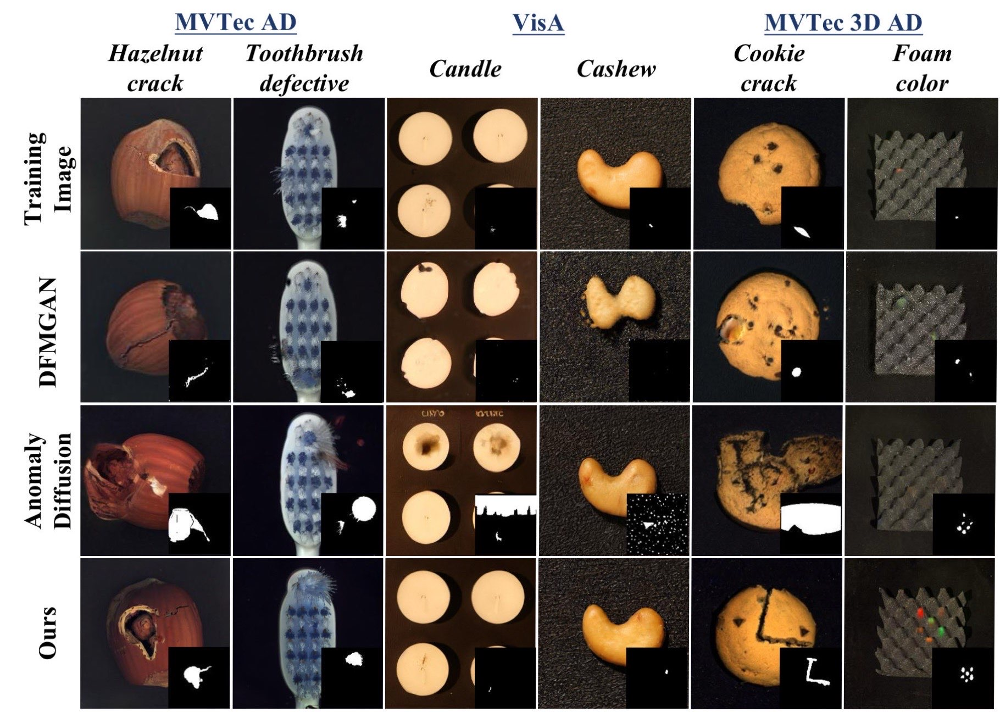
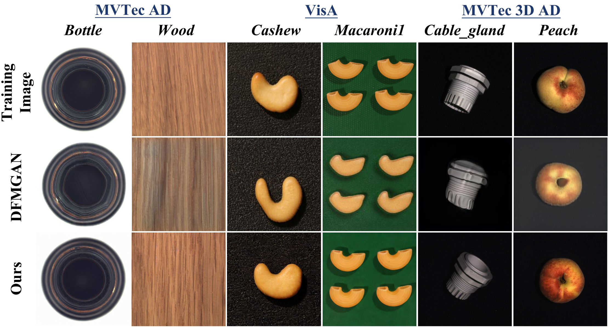

# ✨SeaS✨

**This is an official PyTorch implementation for "SeaS: Few-shot Industrial Anomaly Image Generation with Separation and Sharing Fine-tuning  " (SeaS)**

Authors: 
[Zhewei Dai](https://github.com/DaiZhewei)<sup>1\*</sup>|[Shilei Zeng](https://github.com/ShileiZeng)<sup>1\*</sup>| [Haotian Liu](https://github.com/LHT-HUST)<sup>1</sup> | [Xurui Li](https://github.com/xrli-U)<sup>1</sup> | [Feng Xue](https://xuefeng-cvr.github.io/)<sup>3</sup> | [Yu Zhou](https://github.com/zhouyu-hust)<sup>1,2</sup>

Institutions: <sup>1</sup>Huazhong University of Science and Technology | <sup>2</sup>Wuhan JingCe Electronic Group Co.,LTD | <sup>3</sup>University of Trento

### 🧐[Arxiv](https://arxiv.org/pdf/2410.14987.pdf)

<span id='all_catalogue'/>


## 📣Updates:
***07/20/2025***
We have updated the environment configuration file to address some known issues. Please update your local "requirements.txt" file accordingly.

***07/16/2025***

1. The complete code of SeaS in [paper](https://arxiv.org/pdf/2410.14987.pdf) is released.
2. The generated [image-mask pairs](https://huggingface.co/datasets/HUST-SLOW/SeaS/tree/main/Generated_Anomaly_Images) of SeaS is released.
3. The complete code of downstream segmentation models [LFD](https://github.com/HUST-SLOW/LFD) is released.

## 📖Catalogue

* <a href='#abstract'>1. Abstract</a>
* <a href='#setup'>2. Environment setup</a>
* <a href='#downloads'>3. Downloads</a>
  * <a href='#datatets_mvtec_ad'>MVTec AD</a>
  * <a href='#datatets_visa'>VisA</a>
  * <a href='#datatets_mvtec_3d_ad'>MVTec 3D AD</a>
  * <a href='#models_sd'>Stable-Diffusion</a>
* <a href='#run_seas'>4. Run SeaS</a>
  * <a href='#sh_train_generation'>Training Anomaly Image Generation Model</a>
  * <a href='#sh_train_mask_prediction'>Training Mask Prediction Model</a>
  * <a href='#sh_infer'>Inference</a>
  * <a href='#IC-LPIPS and IS'>IC-LPIPS and IS Metric</a>
* <a href='#downstream'>5. Downstream Segmentation Tasks</a>
* <a href='#results_image_generation'>6. Results of anomaly image generation</a>
* <a href='#results_combining_sysad'>7. Results of combining generated anomalies with synthesis-based anomaly detection methods</a>
* <a href='#results_combining_unad'>8. Results of combining generated normal images with unsupervised anomaly detection methods</a>
* <a href='#results_seg'>9. Results of training supervised segmentation models for anomaly detection and segmentation</a>
* <a href='#citation'>10. Citation</a>
* <a href='#acknowledgement'>11. Acknowledgement</a>
* <a href='#license'>12. License</a>

<span id='abstract'/>

## 👇Abstract: <a href='#all_catalogue'>[Back to Catalogue]</a>

We introduce SeaS, a unified industrial generative model for automatically creating diverse anomalies, authentic normal products, and precise anomaly masks. While extensive research exists, most efforts either focus on specific tasks, i.e., anomalies or normal products only, or require separate models for each anomaly type. Consequently, prior methods either offer limited generative capability or depend on a vast array of anomaly-specific models. We demonstrate that U-Net's differentiated learning ability captures the distinct visual traits of slightly-varied normal products and diverse anomalies, enabling us to construct a unified model for all tasks. Specifically, we first introduce an Unbalanced Abnormal (UA) Text Prompt, comprising one normal token and multiple anomaly tokens. More importantly, our Decoupled Anomaly Alignment (DA) loss decouples anomaly attributes and binds them to distinct anomaly tokens of UA, enabling SeaS to create unseen anomalies by recombining these attributes. Furthermore, our Normal-image Alignment (NA) loss aligns the normal token to normal patterns, making generated normal products globally consistent and locally varied. Finally, SeaS produces accurate anomaly masks by fusing discriminative U-Net features with high-resolution VAE features. SeaS sets a new benchmark for industrial generation, significantly enhancing downstream applications, with average improvements of +8.66% pixel-level AP for synthesis-based AD approaches, +1.10% image-level AP for unsupervised AD methods, and +12.79% IoU for supervised segmentation models. 

 

<span id='setup'/>

## 🎯Setup: <a href='#all_catalogue'>[Back to Catalogue]</a>

### Environment:

- Python 3.9
- CUDA 11.8
- PyTorch 2.1.2

Clone the repository locally:

```
git clone https://github.com/HUST-SLOW/SeaS.git
```

Create virtual environment:

```
conda create --name seas python=3.9
conda activate seas
```

Install the required packages:

```
pip install torch==2.2.1 torchvision==0.17.1
pip install -r requirements.txt
```

And initialize an [Accelerate](https://github.com/huggingface/accelerate/) environment with:

```
accelerate config
```

Or for a default accelerate configuration without answering questions about your environment.

```
accelerate config default
```

Alternatively, use the pre-configured Accelerate settings in `configs/accelerater_config.yaml.`

<span id='downloads'/>

## 👇Downloads: <a href='#all_catalogue'>[Back to Catalogue]</a>

Put all the datasets in `./data` folder.

<span id='datatets_mvtec_ad'/>

### [MVTec AD](https://www.mvtec.com/company/research/datasets/mvtec-ad/)

```
data
|---mvtec_anomaly_detection
|-----|--- bottle
|-----|-----|--- ground_truth
|-----|-----|--- test
|-----|-----|---|--- broken_large
|-----|-----|---|--- broken_small
|-----|-----|---|--- contamination
|-----|-----|---|--- good
|-----|-----|--- train
|-----|-----|---|--- good
|-----|--- cable
|-----|--- ...
```

<span id='datatets_visa'/>

### [VisA](https://github.com/amazon-science/spot-diff)

For VisA we divided the dataset according to defect categories, while dividing the good data in the original dataset into train and good. For downloading the split dataset, please refer to [here](https://huggingface.co/datasets/HUST-SLOW/SeaS/tree/main/VisA_type).

```
data
|---visa
|-----|--- candle
|-----|-----|--- ground_truth
|-----|-----|--- test
|-----|-----|---|--- chunk_of_wax_missing
|-----|-----|---|--- combined
|-----|-----|---|--- good
|-----|-----|---|--- ...
|-----|-----|--- train
|-----|-----|---|--- good
|-----|--- capsules
|-----|--- ...
```

<span id='datatets_mvtec_3d_ad'/>

### [MVTec 3D AD](https://www.mvtec.com/company/research/datasets/mvtec-3d-ad/)

```
data
|---mvtec_3d_anomaly_detection
|-----|--- bagel
|-----|-----|--- test
|-----|-----|---|--- combined
|-----|-----|---|---|--- gt
|-----|-----|---|---|--- rgb
|-----|-----|---|--- contamination
|-----|-----|---|--- crack
|-----|-----|---|--- good
|-----|-----|---|--- hole
|-----|-----|--- train
|-----|-----|---|--- good
|-----|-----|---|---|--- rgb
|-----|--- cable_gland
|-----|--- ...
```

After downloading the original MVTec 3D AD dataset, please run this script:

```
python utils/change_mvtec3d_to_mvtec_type.py
```

Convert the original dataset into an MVTecAD-like structure.

```
data
|---mvtec_3d_anomaly_detection
|-----|--- bagel
|-----|-----|--- ground_truth
|-----|-----|--- test
|-----|-----|---|--- combined
|-----|-----|---|--- contamination
|-----|-----|---|--- crack
|-----|-----|---|--- good
|-----|-----|---|--- hole
|-----|-----|--- train
|-----|-----|---|--- good
|-----|--- cable
|-----|--- ...
```

<span id='models_sd'/>

### [Stable-Diffusion-v1-4](https://huggingface.co/CompVis/stable-diffusion-v1-4)

If you want download stable-diffusion-v1-4, you can use the following command:
```
pip install huggingface_hub
huggingface-cli download CompVis/stable-diffusion-v1-4 --resume-download --local-dir model_hub/stable-diffusion-v1-4
```
You can also download the models manually, and put it in `./model_hub`  folder:
```
model_hub
|---stable-diffusion-v1-4
|-----|--- feature_extractor
|-----|--- safety_checker
|-----|--- scheduler
|-----|--- text_encoder
|-----|--- tokenizer
|-----|--- unet
|-----|--- vae
|-----|--- model_index.json
```

<span id='run_seas'/>

## 💎Run SeaS: <a href='#all_catalogue'>[Back to Catalogue]</a>

The SeaS implementation is divided into three stages:

Training anomaly image generation model stage, training mask generation model stage, and inference stage.

<span id='sh_train_generation'/>

### Training Anomaly Image Generation Model

```
bash scripts/train_generation.sh
```

The configuration in the script `./configs/seas.yaml` takes precedence.

The key arguments of the script are as follows:

- `--output_dir`: The directory to save checkpoints.  
- `--instance_data_dir`: The directory of defect images in datasets.
- `--mask_dir`: The directory of the corresponding masks of defect images in datasets.
- `--normal_data_dir`: The directory of normal images in datasets.
- `--gen_train_steps`: Total number of training steps to perform, for the training of image generation model.  
- `--checkpointing_steps`: Save a checkpoint of the training state every X updates.

The checkpoints of the anomaly image generation model (unet, tokenizer, text_encoder) are saved in `./output_dir/checkpoints/*/generation-checkpoint`.

<span id='sh_train_mask_prediction'/>

### Training Mask Prediction Model

```
bash scripts/train_mask.sh
```

The key arguments of the script are as follows:

- `--output_dir`: The directory to save checkpoints.  
- `--instance_data_dir`: The directory of defect images in datasets.  
- `--mask_dir`: The directory of the corresponding masks of defect images in datasets.  
- `--normal_data_dir`: The directory of normal images in datasets.
- `--seas_trained_model_path`: The directory of seas trained generation models, i.e., the directory of the checkpoints of the generation model.
- `--mask_train_steps`: Total number of training steps to perform, for the training of the mask generation model.  
- `--checkpointing_steps`: Save a checkpoint of the training state every X updates.

The script `train_mask.sh` takes the path of checkpoints of the anomaly image generation model as input. Then we train the Refined Mask Prediction (RMP) model for the same product as the generation model is trained on, the checkpoints of the RMP model are saved in `./output_dir/checkpoints/*/mask-checkpoint/rmp`.

<span id='sh_infer'/>

### Inference

```
bash scripts/infer.sh
```

The key arguments of the script are as follows:

- `--output_dir`: The directory to save images.  
- `--ref_data_dir`: The directory of normal images in datasets.
- `--gen_model_path`: The path of the weight of the trained generation model, i.e., the directory of the checkpoints of the generation model.
- `--rmp_model_path`: The directory of pretrained models, i.e., the directory of the checkpoints of the Refined Mask Prediction (RMP) model. 
- `--prompt`: The unbalanced abnormal text prompt.  
- `--total_infer_num`: The number of generated images.  

The script `infer.sh` takes the path of checkpoints of the anomaly image generation model (`--gen_model_path`) and the Refined Mask Prediction (RMP) model (`--rmp_model_path`) as input.

In `scripts/infer.sh` we provide the `broken_large` anomaly of product `bottle` as an example. For the `infer.sh` for all anomalies of all products, please run this script：

```
python utils/generate_infer_sh.py
```

<span id='IC-LPIPS and IS'/>

### IC-LPIPS and IS metrics

**Testing IC-LPIPS metric**
```
python utils/metrics/metrics_lpips.py
```

The key arguments of the script are as follows:

- `--output_dir`: The directory of the generated images of one anomaly type.
- `--instance_dir`: The directory of the images in the real anomaly images of the same anomaly type.

<span id='Testing IS metric'/>

**Testing IS metric**

We use torch-fidelity to calculate the IS metric. Please refer to [torch-fidelity](https://github.com/rosinality/torch-fidelity) for installation. And run the following command to calculate the Inception Score of a directory of images stored in outputs/images/*, such as `outputs/images/bottle/broken_large/images`.

```
fidelity --gpu 0 --isc --input1 outputs/images/*
```

For comparison with other methods, we resize all images to 256x256 before calculating the IS.

<span id='downstream'/>

## 🧐Downstream Segmentation Tasks: <a href='#all_catalogue'>[Back to Catalogue]</a>

In the downstream segmentation tasks, we use BiSeNet V2, UperNet and LFD. For BiSeNet V2 and UperNet, we use the official implementation in [MMSegmentation](https://github.com/open-mmlab/mmsegmentation). For LFD, we use the official implementation, which can be found in [LFD](https://github.com/HUST-SLOW/LFD). Considering both model size and performance, we recommend to use LFD.

<span id='results_image_generation'/>

## 🎖️Results of anomaly image generation: <a href='#all_catalogue'>[Back to Catalogue]</a>

We run SeaS on A100 GPU with 22G memory. All the results are implemented by the default settings in our paper. For downloading the generated image-mask pairs, please refer to [here](https://huggingface.co/datasets/HUST-SLOW/SeaS/tree/main/Generated_Anomaly_Images).

|     Methods      |   MVTec AD   |                    |                 |                       |     VisA     |                    |                 |                       | MVTec 3D AD  |                    |                 |                       |
| :--------------: | :----------: | :----------------: | :-------------: | :-------------------: | :----------: | :----------------: | :-------------: | :-------------------: | :----------: | :----------------: | :-------------: | :-------------------: |
|                  | IS $\uparrow$ | IC-LPIPS $\uparrow$ | KID $\downarrow$ | IC-LPIPS(a) $\uparrow$ | IS $\uparrow$ | IC-LPIPS $\uparrow$ | KID $\downarrow$ | IC-LPIPS(a) $\uparrow$ | IS $\uparrow$ | IC-LPIPS $\uparrow$ | KID $\downarrow$ | IC-LPIPS(a) $\uparrow$ |
|    Crop&Paste    |     1.51     |        0.14        |        -        |           -           |      -       |         -          |        -        |           -           |      -       |         -          |        -        |           -           |
|      SDGAN       |     1.71     |        0.13        |        -        |           -           |      -       |         -          |        -        |           -           |      -       |         -          |        -        |           -           |
|    Defect-GAN    |     1.69     |        0.15        |                 |                       |              |                    |                 |                       |              |                    |                 |                       |
|      DFMGAN      |     1.72     |        0.20        |      0.12       |         0.14          |     1.25     |        0.25        |      0.24       |         0.05          |     1.80     |        0.29        |      0.19       |         0.08          |
| AnomalyDiffusion |     1.80     |        0.32        |        -        |         0.12          |     1.26     |        0.25        |        -        |         0.04          |     1.61     |        0.22        |        -        |         0.07          |
|       Ours       |   **1.88**   |      **0.34**      |    **0.04**     |       **0.18**        |   **1.27**   |      **0.26**      |    **0.02**     |       **0.06**        |   **1.95**   |      **0.30**      |    **0.06**     |       **0.09**        |

The generation results of anomaly images and normal images are shown as follows:
 
 

<span id='results_combining_sysad'/>

## 🎖️Results of combining generated anomalies with synthesis-based anomaly detection methods: <a href='#all_catalogue'>[Back to Catalogue]</a>

**MVTec AD**

| Methods      |           | Image-level |           |           |           | Pixel-level |           |
| ------------ | --------- | ----------- | --------- | --------- | --------- | ----------- | --------- |
|              | AUROC     | AP          | F1-max    | AUROC     | AP        | F1-max      | IoU       |
| DRAEM        | 98.00     | 98.45       | 96.34     | 97.90     | 67.89     | 66.04       | **60.30** |
| DRAEM+SeaS   | **98.64** | **99.40**   | **97.89** | **98.11** | **76.55** | **72.70**   | 58.87     |
| GLASS        | 99.92     | 99.98       | 99.60     | 99.27     | 74.09     | 70.42       | 57.14     |
| GLASS+SeaS   | **99.97** | **99.99**   | **99.81** | **99.29** | **76.82** | **72.38**   | **57.45** |
| Average      | 98.96     | 99.22       | 97.97     | 98.59     | 70.99     | 68.23       | **58.72** |
| Average+SeaS | **99.31** | **99.70**   | **98.85** | **98.70** | **76.69** | **72.54**   | 58.16     |

**VisA**

| Methods      |           | Image-level |           |           |           | Pixel-level |           |
| ------------ | --------- | ----------- | --------- | --------- | --------- | ----------- | --------- |
|              | AUROC     | AP          | F1-max    | AUROC     | AP        | F1-max      | IoU       |
| DRAEM        | 86.28     | 85.30       | 81.66     | 92.92     | 17.15     | 22.95       | 13.57     |
| DRAEM+SeaS   | **88.12** | **87.04**   | **83.04** | **98.45** | **49.05** | **48.62**   | **35.00** |
| GLASS        | 97.68     | 96.89       | 93.03     | **98.47** | 45.58     | 48.39       | 39.92     |
| GLASS+SeaS   | **97.88** | **97.39**   | **93.21** | 98.43     | **48.06** | **49.32**   | **40.00** |
| Average      | 91.98     | 91.10       | 87.35     | 95.70     | 31.37     | 35.67       | 26.75     |
| Average+SeaS | **93.00** | **92.22**   | **88.13** | **98.44** | **48.56** | **48.97**   | **37.50** |

**MVTec 3D AD**

| Methods      |           | Image-level |           |           |           | Pixel-level |           |
| ------------ | --------- | ----------- | --------- | --------- | --------- | ----------- | --------- |
|              | AUROC     | AP          | F1-max    | AUROC     | AP        | F1-max      | IoU       |
| DRAEM        | 79.16     | 90.90       | 89.78     | 86.73     | 14.02     | 17.00       | 12.42     |
| DRAEM+SeaS   | **85.45** | **93.58**   | **90.85** | **95.43** | **20.09** | **26.10**   | **17.07** |
| GLASS        | 92.34     | 96.85       | **93.37** | 98.46     | 48.46     | 49.13       | 45.03     |
| GLASS+SeaS   | **92.95** | **97.38**   | 93.21     | **98.73** | **48.55** | **49.28**   | **46.02** |
| Average      | 85.75     | 93.88       | 91.58     | 92.60     | 31.24     | 33.07       | 28.73     |
| Average+SeaS | **89.20** | **95.48**   | **92.03** | **97.08** | **34.32** | **37.69**   | **31.55** |


<span id='results_combining_unad'/>

## 🎖️Results of combining generated normal images with unsupervised anomaly detection methods: <a href='#all_catalogue'>[Back to Catalogue]</a>

**MVTec AD**

| Methods          |           | Image-level |           |           |           | Pixel-level |           |
| ---------------- | --------- | ----------- | --------- | --------- | --------- | ----------- | --------- |
|                  | AUROC     | AP          | F1-max    | AUROC     | AP        | F1-max      | IoU       |
| HVQ-Trans        | 96.38     | 98.09       | 95.30     | **97.60** | 47.95     | 53.32       | **45.03** |
| HVQ-Trans + SeaS | **97.25** | **98.48**   | **95.78** | 97.58     | **48.53** | **53.84**   | 44.61     |
| PatchCore        | 98.63     | 99.47       | 98.18     | **98.37** | 56.13     | 58.83       | 49.45     |
| PatchCore + SeaS | **98.64** | **99.48**   | **98.22** | **98.37** | **63.98** | **64.07**   | **55.43** |
| MambaAD          | 98.54     | 99.52       | 97.77     | **97.67** | 56.23     | 59.34       | 51.31     |
| MambaAD + SeaS   | **98.80** | **99.64**   | **98.40** | 97.66     | **56.86** | **59.70**   | **51.51** |
| Average          | 97.85     | 99.03       | 97.08     | **97.88** | 53.44     | 57.16       | 48.60     |
| Average(+ SeaS)  | **98.23** | **99.20**   | **97.47** | 97.87     | **56.46** | **59.20**   | **50.52** |

**VisA**

| Methods          |           | Image-level |           |           |           | Pixel-level |           |
| ---------------- | --------- | ----------- | --------- | --------- | --------- | ----------- | --------- |
|                  | AUROC     | AP          | F1-max    | AUROC     | AP        | F1-max      | IoU       |
| HVQ-Trans        | 90.11     | 88.18       | 84.08     | 98.10     | 28.67     | 35.05       | **24.03** |
| HVQ-Trans + SeaS | **92.12** | **90.35**   | **86.23** | **98.15** | **29.52** | **36.00**   | 23.60     |
| PatchCore        | 94.84     | 95.98       | 91.69     | 98.38     | 48.58     | 49.69       | 42.44     |
| PatchCore + SeaS | **94.97** | **96.06**   | **91.81** | **98.41** | **48.60** | **49.72**   | **42.46** |
| MambaAD          | 94.19     | 94.44       | 89.55     | 98.49     | 39.27     | **44.18**   | **37.68** |
| MambaAD + SeaS   | **94.23** | **94.65**   | **89.93** | **98.70** | **39.33** | 43.99       | 36.62     |
| Average          | 93.05     | 92.87       | 88.44     | 98.32     | 38.84     | 42.97       | **34.72** |
| Average(+ SeaS)  | **93.77** | **93.69**   | **89.32** | **98.42** | **39.15** | **43.24**   | 34.23     |

**MVTec 3D AD**

| Methods          |           | Image-level |           |           |           | Pixel-level |           |
| ---------------- | --------- | ----------- | --------- | --------- | --------- | ----------- | --------- |
|                  | AUROC     | AP          | F1-max    | AUROC     | AP        | F1-max      | IoU       |
| HVQ-Trans        | 68.15     | 84.38       | 85.20     | 96.40     | 17.23     | 24.59       | **20.51** |
| HVQ-Trans + SeaS | **71.26** | **90.35**   | **89.23** | **96.56** | **19.34** | **26.40**   | 20.47     |
| PatchCore        | 83.44     | 94.89       | 92.24     | 98.55     | 34.52     | 39.09       | 39.29     |
| PatchCore + SeaS | **83.88** | **94.97**   | **92.32** | **98.56** | **34.65** | **39.41**   | **39.43** |
| MambaAD          | 85.92     | 95.69       | 92.51     | 98.57     | **37.30** | **41.08**   | 39.44     |
| MambaAD + SeaS   | **88.67** | **96.60**   | **93.41** | **98.74** | 35.46     | 39.59       | **39.51** |
| Average          | 79.17     | 91.65       | 89.98     | 97.84     | 29.68     | 34.92       | 33.08     |
| Average(+ SeaS)  | **81.27** | **93.97**   | **91.65** | **97.95** | **29.82** | **35.13**   | **33.14** |


<span id='results_seg'/>

## 🎖️Results of training supervised segmentation models for anomaly detection and segmentation: <a href='#all_catalogue'>[Back to Catalogue]</a>

**MVTec AD**

| Segmentation Models | Generative Models |           | Image-level |           |           | Pixel-level |           |           |
| ------------------- | ----------------- | --------- | ----------- | --------- | --------- | ----------- | --------- | --------- |
|                     |                   | AUROC     | AP          | F1-max    | AUROC     | AP          | F1-max    | IoU       |
|                     | DFMGAN            | 90.90     | 94.43       | 90.33     | 94.57     | 60.42       | 60.54     | 45.83     |
| BiSeNet V2          | AnomalyDiffusion  | 90.08     | 94.84       | 91.84     | 96.27     | 64.50       | 62.27     | 42.89     |
|                     | SeaS              | **96.00** | **98.14**   | **95.43** | **97.21** | **69.21**   | **66.37** | **55.28** |
|                     | DFMGAN            | 90.74     | 94.43       | 90.37     | 92.33     | 57.01       | 56.91     | 46.64     |
| UperNet             | AnomalyDiffusion  | 96.62     | 98.61       | 96.21     | 96.87     | 69.92       | 66.95     | 50.80     |
|                     | SeaS              | **98.29** | **99.20**   | **97.34** | **97.87** | **74.42**   | **70.70** | **61.24** |
|                     | DFMGAN            | 91.08     | 95.40       | 90.58     | 94.91     | 67.06       | 65.09     | 45.49     |
| LFD                 | AnomalyDiffusion  | 95.15     | 97.78       | 94.66     | 96.30     | 69.77       | 66.99     | 45.77     |
|                     | SeaS              | **95.88** | **97.89**   | **95.15** | **98.09** | **77.15**   | **72.52** | **56.47** |
|                     | DFMGAN            | 90.91     | 94.75       | 90.43     | 93.94     | 61.50       | 60.85     | 45.99     |
| Average             | AnomalyDiffusion  | 93.95     | 97.08       | 94.24     | 96.48     | 68.06       | 65.40     | 46.49     |
|                     | SeaS              | **96.72** | **98.41**   | **95.97** | **97.72** | **73.59**   | **69.86** | **57.66** |

**VisA**

| Segmentation Models | Generative Models |           | Image-level |           |           | Pixel-level |           |           |
| ------------------- | ----------------- | --------- | ----------- | --------- | --------- | ----------- | --------- | --------- |
|                     |                   | AUROC     | AP          | F1-max    | AUROC     | AP          | F1-max    | IoU       |
|                     | DFMGAN            | 63.07     | 62.63       | 66.48     | 75.91     | 9.17        | 15.00     | 9.66      |
| BiSeNet V2          | AnomalyDiffusion  | 76.11     | 77.74       | 73.13     | 89.29     | 34.16       | 37.93     | 15.93     |
|                     | SeaS              | **85.61** | **86.64**   | **80.49** | **96.03** | **42.80**   | **45.41** | **25.93** |
|                     | DFMGAN            | 71.69     | 71.64       | 70.70     | 75.09     | 12.42       | 18.52     | 15.47     |
| UperNet             | AnomalyDiffusion  | 83.18     | 84.08       | 78.88     | 95.00     | 39.92       | 45.37     | 20.53     |
|                     | SeaS              | **90.34** | **90.73**   | **84.33** | **97.01** | **55.46**   | **55.99** | **35.91** |
|                     | DFMGAN            | 65.38     | 62.25       | 66.59     | 81.21     | 15.14       | 18.70     | 6.44      |
| LFD                 | AnomalyDiffusion  | 81.97     | 82.36       | 77.35     | 88.00     | 30.86       | 38.56     | 16.61     |
|                     | SeaS              | **83.07** | **82.88**   | **77.24** | **92.91** | **43.87**   | **46.46** | **26.37** |
|                     | DFMGAN            | 66.71     | 65.51       | 67.92     | 77.40     | 12.24       | 17.41     | 10.52     |
| Average             | AnomalyDiffusion  | 80.42     | 81.39       | 76.45     | 90.76     | 34.98       | 40.62     | 17.69     |
|                     | SeaS              | **86.34** | **86.75**   | **80.69** | **95.32** | **47.38**   | **49.29** | **29.40** |

**MVTec 3D AD**

| Segmentation Models | Generative Models |           | Image-level |           |           | Pixel-level |           |           |
| ------------------- | ----------------- | --------- | ----------- | --------- | --------- | ----------- | --------- | --------- |
|                     |                   | AUROC     | AP          | F1-max    | AUROC     | AP          | F1-max    | IoU       |
|                     | DFMGAN            | 61.88     | 81.80       | 84.44     | 75.89     | 15.02       | 21.73     | 15.68     |
| BiSeNet V2          | AnomalyDiffusion  | 61.49     | 81.35       | 85.36     | **92.39** | 15.15       | 20.09     | 14.70     |
|                     | SeaS              | 73.60     | **87.75**   | **85.82** | 90.41     | **26.04**   | **32.61** | **28.55** |
|                     | DFMGAN            | 67.56     | 84.53       | 84.99     | 75.12     | 19.54       | 26.04     | 18.78     |
| UperNet             | AnomalyDiffusion  | 76.56     | 90.42       | 87.35     | 88.48     | 28.95       | 35.81     | 25.04     |
|                     | SeaS              | **82.57** | **92.59**   | **88.72** | **91.93** | **38.51**   | **43.53** | **38.56** |
|                     | DFMGAN            | 62.23     | 82.17       | 85.38     | 72.15     | 9.54        | 14.29     | 14.81     |
| LFD                 | AnomalyDiffusion  | 77.06     | 89.44       | 87.20     | **92.68** | 24.29       | 32.74     | 19.90     |
|                     | SeaS              | **78.96** | **91.22**   | **87.28** | 91.61     | **40.25**   | **43.47** | **39.00** |
|                     | DFMGAN            | 63.89     | 83.83       | 84.94     | 74.39     | 14.70       | 20.69     | 16.42     |
| Average             | AnomalyDiffusion  | 71.70     | 87.07       | 86.64     | 91.18     | 22.80       | 29.55     | 19.88     |
|                     | SeaS              | **78.38** | **90.52**   | **87.27** | **91.32** | **34.93**   | **39.87** | **35.37** |

<span id='citation'/>

## Citation: <a href='#all_catalogue'>[Back to Catalogue]</a>
```
@inproceedings{dai2025SeaS,
  title={SeaS: Few-shot Industrial Anomaly Image Generation with Separation and Sharing Fine-tuning},
  author={Zhewei Dai, Shilei Zeng, Haotian Liu, Xurui Li, Feng Xue, Yu Zhou},
  booktitle={Proceedings of the IEEE/CVF International Conference on Computer Vision},
  year={2025}
}
```

<span id='acknowledgement'/>

## Acknowledgement: <a href='#all_catalogue'>[Back to Catalogue]</a>

Our repo is built on [Diffusers](https://github.com/huggingface/diffusers), thanks their clear and elegant code!

<span id='license'/>

## License: <a href='#all_catalogue'>[Back to Catalogue]</a>
SeaS is released under the **MIT License**, and is fully open for academic research and also allow free commercial usage. To apply for a commercial license, please contact yuzhou@hust.edu.cn.
